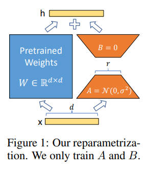
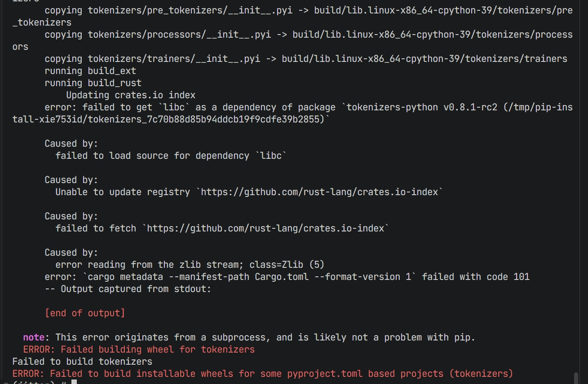

# LoRA_pytorch_reproduction & jittor_alignment

> **LoRA: Low-Rank Adaptation of Large Language Models** <br>
> *Edward J. Hu\*, Yelong Shen\*, Phillip Wallis, Zeyuan Allen-Zhu, Yuanzhi Li, Shean Wang, Lu Wang, Weizhu Chen* <br>
> Paper: https://arxiv.org/abs/2106.09685 <br>
> Github: https://github.com/microsoft/LoRA <br>

LoRA（Low-Rank Adaptation）是一种高效的预训练模型微调方法，旨在在保持模型性能的同时显著降低训练开销。  
<div align="center">
  
</div>

1. 实现方式  
- 在模型的部分权重矩阵（如注意力层的 $W_q$、$W_v$）引入低秩分解结构。  
- 将原权重 $W$ 表示为：

$$
  W' = W + BA
$$

- 其中 $A \in \mathbb{R}^{r\times k}$ 、 $B \in \mathbb{R}^{d\times r}$ ，秩 $r \ll \min(d,k)$ 。  
- 冻结原有权重，仅训练新增的低秩矩阵 $A$ 、 $B$ 。  

2. 优势  
- **参数高效**：大幅减少可训练参数量，通常降低至全量微调的 $0.1\%\sim1\%$ 。  
- **显存友好**：节省显存占用，支持更大批量或更长序列的训练。  
- **性能保持**：在多个下游任务上性能接近甚至匹配全量微调。  

## 复现任务要求
1. 使用pytorch和jittor两种框架对原论文进行复现，并进行性能对齐。

2. 将环境配置、数据准备脚本、训练脚本、测试脚本、与pytorch实现对齐的实验log，性能log都放在README中。

PS:如果计算资源有限，用少量数据的训练效果和pytorch版本的结果对齐.

* [X] [环境配置](#environment)
* [X] [数据准备脚本](#data-prepare)
* [X] [训练脚本](#run)
* [X] [测试脚本](#run)
* [X] [性能Log](#traineval-log)
* [X] [jittor与pytorch实现对齐的实验log](#traineval-log)

## Content

| Section                                 | Description     |
| --------------------------------------- | --------------- |
| [Overview](#overview)                      |                 |
| [Experiment](#experiment)                  | 环境配置，实验设计，注意事项  |
| [Train/Eval Log](#traineval-log) | 日志、运行结果  |
| [Performance Comparison](#performance-comparison)    | 性能对比    |
| [Jittor Alignment](#jittor-alignment)        | Jittor 架构实现 |
| [Reference](#reference)                    |                 |
| [Citation](#citation)                      |                 |

## Overview


由于服务器资源有限，且原始LoRA仓库代码完整度较高，NLG实例上的三个数据集（e2e、webnlg、dart）复现方式除了e2e与webnlg、dart的评估需要切换评估脚本，但这个也是直接在原仓库中就写好的，其余部分没有实质性的区别。因此本仓库主要做了以下工作：
1. 基于Pytorch框架复现LoRA在 NLG 实例中e2e数据集上的所有实验，包括模型训练、推理、评估等，验证复现性能对齐原论文。(https://github.com/1Reminding/LoRA_Jittor/tree/main/NLG_pytorch)
2. 使用Jittor重写LoRA的torch实现，验证Jittor框架在NLG任务上的性能对齐。(https://github.com/1Reminding/LoRA_Jittor/tree/main/NLG_jittor)

本仓库的复现对齐原论文性能损失较小，且根据Jittor官方文档和相关资料重构代码，最终结果显示Jittor框架在NLG任务上的性能与Pytorch框架对齐。


## Experiment

### Environment

该仓库所有实验均在 AutoDL 平台租用云服务器实现，配置如下：
1. conda env1 (torch):
* 镜像 PyTorch 2.3.0 + Python 3.8(ubuntu22.04) + CUDA 12.1
* GPU RTX 3090(24GB) * 1
* CPU 14 vCPU Intel(R) Xeon(R) Gold 6330 
* 内存 90GB
* 硬盘 系统盘: 30 GB 数据盘: 50GB

具体环境中的 requirment 已导出所有包信息，torch(CUDA)版本在虚拟环境中设置为 1.7.1+cu101 （与原仓库相符）

2. conda env2 (jittor)
* jittor 1.3.10.0 + Python 3.9(ubuntu22.04) + CUDA 12.1

低于3.9 版本Python不兼容很多必要的包，具体环境中的 requirment 已导出所有包信息。

由于官方文档代码实现非常完整，复现过程中环境配置是保证代码运行的前提，下面是你在环境配置中可以参考的一些信息：

1. 安装 transformer 遇到 tokenizer rust编译的问题

解决方案一（肯定能奏效）：

安装transformers 3.3.1但不安装其依赖，然后我们手动安装除tokenizers外的其他依赖。

```bash
pip install tokenizers==0.9.4
pip install transformers==3.3.1 --no-deps
pip install filelock regex sacremoses requests tqdm
```

不直接安装rust，因为用的是老的 transformers==3.3.1，它预期的 tokenizers 版本是 0.8.x。就算装了 Rust，pip 可能拉到较新的 tokenizers 源码（0.14/0.15…），与 3.3.1 API 不兼容，编出来也会冲突或运行时报错。

解决方案二（不一定奏效）：

```
curl --proto '=https' --tlsv1.2 -sSf https://sh.rustup.rs | sh
source $HOME/.cargo/env
pip install tokenizers==0.9.4
pip install transformers==3.3.1
```

直接安装rust，但是安装过程中可能会遇到一些问题，比如缺少一些库文件，这个时候需要根据错误提示去安装缺少的库文件。
2. 直接 pip install spacy 会出现的问题
- 需要 Cython 模块支持，需要先 pip install cython
- blis包的构建一直卡住，需要先 pip install blis==0.7.11
- version 'GLIBCXX_3.4.30' not found 错误
```bash
 ImportError: /root/miniconda3/envs/jittor/bin/../lib/libstdc++.so.6: version 'GLIBCXX_3.4.30' not found 
 ```
 Jittor 需要更新版本的 libstdc++.so.6 库，但你的 conda 环境中的版本较旧，不包含 GLIBCXX_3.4.30 符号.

 执行：
 ```bash
strings /usr/lib/x86_64-linux-gnu/libstdc++.so.6 | grep GLIBCXX_3.4.30
```
检查系统库是否包含所需版本。
如果系统 /usr/lib/x86_64-linux-gnu/libstdc++.so.6 中已经包含 GLIBCXX_3.4.30 版本，创建一个软链接到 conda 环境中：
```bash
ln -sf /usr/lib/x86_64-linux-gnu/libstdc++.so.6 $CONDA_PREFIX/lib/libstdc++.so.6
```
requirment中的包全部安装完成后，与requirment_pytorch 和requirment_jittor 进行对比，这是我当时冻结环境导出的完整包信息（或者现在就可以启动训练，根据报错进行必须包的安装）。
### Experiment Design

官方仓库包括两个实例：
1. NLG: 任务实现流程与原始 LoRA 论文中的 GPT-2 微调示例高度契合，代码依赖少，改动集中在模型与训练循环。(https://github.com/microsoft/LoRA/tree/main/examples/NLG)
2. NLU: 任务依赖 HuggingFace Transformers 中的高层封装与多任务接口，而 Jittor 在该部分生态支持不完善，实现难度和额外适配工作量更大。(https://github.com/microsoft/LoRA/tree/main/examples/NLU)

因此，本仓库进行 NLG 的复现，可快速验证 LoRA 的核心思想与性能，并便于与 PyTorch 版本进行对照测试。

### Config set
为保证性能损失在资源有限的情况下保持在合理范围内，且保证torch版本和jittor版本不会因为数据量和参数设置带来性能差异，需要进行如下配置：
1. 数据集：
缩小数据规模，但必须根据三个数据集中types的差异，均匀抽取样本，保证在train，test，val上均sampled 18% (保证在torch和jittor框架下不会爆显存，且不会超内存)。
2. 参数设置：
批次大小缩小为原论文的1/2，其他参数设置与原论文参数保持一致。
显存/内存占用降低：

batch size 和显存占用近似线性相关，减半 batch size 可以显著降低一次前向+反向的内存峰值，避免 OOM。每个 step 处理的样本减少，单步训练更快，适合显存、算力受限的环境。


### Start up

这里可能遇到的问题在前面的环境配置章节和后面的Debug章节中都有提到，也许有你需要的解决答案。

Clone repository

```bash
git clone https://github.com/1Reminding/LoRA_Jittor.git
cd LoRA_Jittor
```

Install dependencies 
注意torch和jittor最好新建两个虚拟环境，参见前面环境配置的版本要求。
Pytorch版本：

```bash
cd NLG_pytorch
pip install -r requirement.txt
```

Jittor版本：

```bash
cd NLG_jittor
pip install -r requirement.txt
```

**下面是NLG `e2e` 数据集整体实验流程：训练、推理、解码、评估，作为示例。对齐 torch 和 Jittor 性能。**

替换数据集，只需修改相应脚本中数据集的名称即可，将指令中的 `e2e` 替换为 `webnlg` 、`dart`

### Data prepare

数据预处理：

数据集在train，test，val上均 sampled 18%，且根据数据集的类型，区分数据中的不同types均匀采样(types : restaurant, hotel, attraction, train, bus, taxi...)

下面是对三个数据集中数据类型的部分展示：
```bash
E2E数据集按类别统计
==================================================
类别                  训练集      验证集      测试集      总计        
无类型                21950      1191       0          23141     
coffee shop          10396      3481       287        14164     
pub                  6531       0          2225       8756      
restaurant           3184       0          2181       5365      
总计                  42061      4672       4693       51426     

WebNLG数据集按类别统计(此处展示10个类别)
==================================================
类别                 训练集       验证集      测试集      总计        
Food                 1424       178        177        1779      
Airport              1090       136        136        1362      
Building             972        123        120        1215      
WrittenWork          937        118        116        1171      
SportsTeam           786        99         98         983       
Astronaut            530        67         66         663       
University           406        51         51         508       
City                 243        31         139        413       
ComicsCharacter      285        37         35         357       
Monument             267        32         33         332           
总计                  18025      2258       4928       25211      

DART数据集按类别统计 (此处展示20个类别)
==================================================
类别                 训练集      验证集      测试集       总计        
food                 9960       1063       1315       12338     
eattype              8196       1314       1793       11303     
pricerange           8151       839        1144       10134     
customer rating      7888       1039       772        9699      
area                 7139       1013       1433       9585      
familyfriendly       6492       839        1289       8620      
near                 5505       839        1819       8163      
country              2487       265        738        3490      
[title]              3162       61         69         3292      
location             1706       189        431        2326      
leader_name          1227       158        489        1874      
birth_place          438        48         788        1274      
club                 490        40         605        1135      
year                 1045       17         26         1088      
is_part_of           573        68         347        988       
language             608        56         247        911       
ingredient           652        86         168        906       
ethnic_group         543        57         293        893       
date                 855        22         15         892       
region               596        80         170        846       
总计                  62659      6980       12552      82191     
```
对数据集进行采样
```
python /root/LoRA/NLG_pytorch/sample_datasets.py
```
观察到终端输出如下信息，即可完成小规模数据集构建
```bash
处理 e2e 数据集...
处理 /root/LoRA/NLG_pytorch/data/e2e/train_formatted.jsonl...
  原始数据: 42061条, 抽样后: 7570条
处理 /root/LoRA/NLG_pytorch/data/e2e/valid_formatted.jsonl...
  原始数据: 4672条, 抽样后: 840条
处理 /root/LoRA/NLG_pytorch/data/e2e/test_formatted.jsonl...
  原始数据: 4693条, 抽样后: 844条

处理 webnlg 数据集...
处理 /root/LoRA/NLG_pytorch/data/webnlg_challenge_2017/train_formatted.jsonl...
  原始数据: 18025条, 抽样后: 3244条
处理 /root/LoRA/NLG_pytorch/data/webnlg_challenge_2017/valid_formatted.jsonl...
  原始数据: 2258条, 抽样后: 406条
处理 /root/LoRA/NLG_pytorch/data/webnlg_challenge_2017/test_formatted.jsonl...
  原始数据: 4928条, 抽样后: 886条

处理 dart 数据集...
处理 /root/LoRA/NLG_pytorch/data/dart/train_formatted.jsonl...
  原始数据: 62659条, 抽样后: 11278条
处理 /root/LoRA/NLG_pytorch/data/dart/valid_formatted.jsonl...
  原始数据: 6980条, 抽样后: 1256条
处理 /root/LoRA/NLG_pytorch/data/dart/test_formatted.jsonl...
  原始数据: 12552条, 抽样后: 2259条
  ```
数据条目总览：
|        | train           | test            | valid        |
| ------ | --------------- | --------------------- | ------------ |
| e2e    | 7570（42061）   | 844（4693）           | 840（4672）  |
| webnlg | 3244（18025）   | 886（4928）           | 406（2258）  |
| dart   | 11278（62659）  | 2259（12552）         | 1256（6980） |


### Run 
torch 版本和 jittor 版本只需要cd到两个对应的目录下运行即可（LoRA_Jittor\NLG_pytorch 和 LoRA_Jittor\NLG_jittor）
#### Train

```python
 # train_torch

python -m torch.distributed.launch --nproc_per_node=1 --use_env src/gpt2_ft.py \
    --train_data ./data/e2e/sampled/train.jsonl \
    --valid_data ./data/e2e/sampled/valid.jsonl \
    --train_batch_size 8 \
    --grad_acc 1 \
    --valid_batch_size 4 \
    --seq_len 512 \
    --model_card gpt2.md \
    --init_checkpoint ./pretrained_checkpoints/gpt2-medium-pytorch_model.bin \
    --platform local \
    --clip 0.0 \
    --lr 0.0002 \
    --weight_decay 0.01 \
    --correct_bias \
    --adam_beta2 0.999 \
    --scheduler linear \
    --warmup_step 500 \
    --max_epoch 5 \
    --save_interval 1000 \
    --lora_dim 4 \
    --lora_alpha 32 \
    --lora_dropout 0.1 \
    --label_smooth 0.1 \
    --work_dir ./trained_models/GPT2_M/e2e \
    --random_seed 110
```
jittor版本只需要修改上面脚本的第一句
```python
python src/gpt2_ft.py \
    --train_data ./data/e2e/sampled/train.jsonl \
    --valid_data ./data/e2e/sampled/valid.jsonl \
    ...
```
#### Inference

```python
 # 定义模型检查点列表
# MODELS=("1000","1839","2000","3000","3786","4000","5000","5679","6000","7000","7572","8000","9000","9465")
MODELS=( "9000" )
# 为每个模型运行推理和评估
for model in "${MODELS[@]}"; do
  echo "Processing model.${model}.pt..."

  # 步骤1：生成输出 - 使用 torchrun 替代 torch.distributed.launch
  torchrun --nproc_per_node=1 src/gpt2_beam.py \
      --data ./data/e2e/sampled/test.jsonl \
      --batch_size 1 \
      --seq_len 512 \
      --eval_len 64 \
      --model_card gpt2.md \
      --init_checkpoint ./trained_models/GPT2_M/e2e/model.${model}.pt \
      --platform local \
      --lora_dim 4 \
      --lora_alpha 32 \
      --beam 10 \
      --length_penalty 0.8 \
      --no_repeat_ngram_size 4 \
      --repetition_penalty 1.0 \
      --eos_token_id 628 \
      --work_dir ./trained_models/GPT2_M/e2e \
      --output_file predict.${model}.b10p08r4.jsonl
```
对于jittor版本，仍然只需要修改第一句指令
```python
 time python src/gpt2_beam.py \
     --data ./data/dart/test_1k.jsonl \
     ...
```

#### Decode

```python
   # 步骤2：解码输出
   python src/gpt2_decode.py \
         --vocab ./vocab \
         --sample_file ./trained_models/GPT2_M/e2e/predict.${model}.b10p08r4.jsonl \
         --input_file ./data/e2e/sampled/test_formatted.jsonl \
         --output_ref_file e2e_ref.${model}.txt \
         --output_pred_file e2e_pred.${model}.txt
```

#### Evaluate

```python
   # 步骤3：评估结果 - 更新评估脚本路径
   echo "Evaluation results for model.${model}.pt:" > eval_results.${model}.txt
   python eval/e2e/measure_scores.py e2e_ref.${model}.txt e2e_pred.${model}.txt -p >> eval_results.${model}.txt
   
   echo "Completed evaluation for model.${model}.pt"
```

对于`webnlg` 和 `dart` 修改脚本使用 GenerationEval 进行评估。


ATTENTION: 原代码的逻辑已经在终端输出记录详细的 Log，注意保存

## Train/Eval Log

下面展示torch和jittor版本的性能，以及对齐性能log （完整文件位于两个框架文件夹的trained_models/GPT2_M/...下）。 

### dataset: e2e

部分训练 log 展示如下：
torch 版本

```bash
eval samples: 400 loss: tensor(1.0887, device='cuda:0')
average loss 1.364281438220115
----------------------------------------------------------------------------------------------------
| Eval   1 at step     2000 | time: 35.43s | valid loss  1.36 | valid ppl  3.91 | best ppl  3.91 
----------------------------------------------------------------------------------------------------
| epoch   2 step     2100 |    207 batches | lr 0.000164 | ms/batch 728.20 | loss  2.57 | avg loss  2.67 | ppl 14.51
| epoch   2 step     2200 |    307 batches | lr 0.000162 | ms/batch 371.82 | loss  2.47 | avg loss  2.68 | ppl 14.59
| epoch   2 step     2300 |    407 batches | lr 0.00016 | ms/batch 372.78 | loss  2.73 | avg loss  2.64 | ppl 14.05
| epoch   2 step     2400 |    507 batches | lr 0.000158 | ms/batch 374.93 | loss  2.44 | avg loss  2.69 | ppl 14.80
| epoch   2 step     2500 |    607 batches | lr 0.000155 | ms/batch 374.52 | loss  2.84 | avg loss  2.70 | ppl 14.86
| epoch   2 step     2600 |    707 batches | lr 0.000153 | ms/batch 368.80 | loss  2.40 | avg loss  2.68 | ppl 14.57
| epoch   2 step     2700 |    807 batches | lr 0.000151 | ms/batch 374.33 | loss  2.30 | avg loss  2.67 | ppl 14.50
| epoch   2 step     2800 |    907 batches | lr 0.000149 | ms/batch 374.06 | loss  2.94 | avg loss  2.65 | ppl 14.21
| epoch   2 step     2900 |   1007 batches | lr 0.000146 | ms/batch 371.49 | loss  2.70 | avg loss  2.66 | ppl 14.26
| epoch   2 step     3000 |   1107 batches | lr 0.000144 | ms/batch 373.31 | loss  2.54 | avg loss  2.68 | ppl 14.55
saving checkpoint /root/autodl-tmp/trained_models/GPT2_M/e2e/model.3000.pt
| epoch   2 step     3100 |   1207 batches | lr 0.000142 | ms/batch 372.96 | loss  2.46 | avg loss  2.65 | ppl 14.20
| epoch   2 step     3200 |   1307 batches | lr 0.00014 | ms/batch 372.59 | loss  2.77 | avg loss  2.66 | ppl 14.24
| epoch   2 step     3300 |   1407 batches | lr 0.000138 | ms/batch 373.02 | loss  3.04 | avg loss  2.61 | ppl 13.62
| epoch   2 step     3400 |   1507 batches | lr 0.000135 | ms/batch 372.70 | loss  2.93 | avg loss  2.66 | ppl 14.27
| epoch   2 step     3500 |   1607 batches | lr 0.000133 | ms/batch 372.64 | loss  2.56 | avg loss  2.63 | ppl 13.85
| epoch   2 step     3600 |   1707 batches | lr 0.000131 | ms/batch 372.86 | loss  2.44 | avg loss  2.62 | ppl 13.70
| epoch   2 step     3700 |   1807 batches | lr 0.000129 | ms/batch 373.10 | loss  2.32 | avg loss  2.67 | ppl 14.41
saving checkpoint /root/autodl-tmp/trained_models/GPT2_M/e2e/model.3786.pt
start to train the model................ 3
```
jittor 版本
```bash
eval samples: 400 loss: jt.Var([1.4633853], dtype=float32)
average loss 1.3697681188583375
----------------------------------------------------------------------------------------------------
| Eval   1 at step     2000 | time: 62.58s | valid loss  1.37 | valid ppl  3.93 | best ppl  3.93 
----------------------------------------------------------------------------------------------------
| epoch   2 step     2100 |    207 batches | lr 0.000164 | ms/batch 1167.23 | loss  2.52 | avg loss  2.70 | ppl 14.94
| epoch   2 step     2200 |    307 batches | lr 0.000162 | ms/batch 539.79 | loss  2.97 | avg loss  2.74 | ppl 15.42
| epoch   2 step     2300 |    407 batches | lr 0.00016 | ms/batch 543.69 | loss  2.65 | avg loss  2.68 | ppl 14.55
| epoch   2 step     2400 |    507 batches | lr 0.000158 | ms/batch 538.26 | loss  2.93 | avg loss  2.66 | ppl 14.30
| epoch   2 step     2500 |    607 batches | lr 0.000155 | ms/batch 540.69 | loss  2.71 | avg loss  2.71 | ppl 15.01
| epoch   2 step     2600 |    707 batches | lr 0.000153 | ms/batch 540.72 | loss  2.60 | avg loss  2.69 | ppl 14.76
| epoch   2 step     2700 |    807 batches | lr 0.000151 | ms/batch 542.45 | loss  3.14 | avg loss  2.65 | ppl 14.15
| epoch   2 step     2800 |    907 batches | lr 0.000149 | ms/batch 542.87 | loss  2.37 | avg loss  2.68 | ppl 14.61
| epoch   2 step     2900 |   1007 batches | lr 0.000146 | ms/batch 541.74 | loss  2.49 | avg loss  2.65 | ppl 14.20
| epoch   2 step     3000 |   1107 batches | lr 0.000144 | ms/batch 541.19 | loss  2.60 | avg loss  2.63 | ppl 13.93
saving checkpoint /root/autodl-tmp/trained_models/GPT2_M/e2e_jittor/model.3000.pt
| epoch   2 step     3100 |   1207 batches | lr 0.000142 | ms/batch 542.25 | loss  2.79 | avg loss  2.67 | ppl 14.51
| epoch   2 step     3200 |   1307 batches | lr 0.00014 | ms/batch 540.94 | loss  2.46 | avg loss  2.63 | ppl 13.83
| epoch   2 step     3300 |   1407 batches | lr 0.000138 | ms/batch 540.62 | loss  2.86 | avg loss  2.65 | ppl 14.20
| epoch   2 step     3400 |   1507 batches | lr 0.000135 | ms/batch 540.87 | loss  2.31 | avg loss  2.65 | ppl 14.10
| epoch   2 step     3500 |   1607 batches | lr 0.000133 | ms/batch 540.97 | loss  2.52 | avg loss  2.65 | ppl 14.16
| epoch   2 step     3600 |   1707 batches | lr 0.000131 | ms/batch 540.57 | loss  2.71 | avg loss  2.59 | ppl 13.37
| epoch   2 step     3700 |   1807 batches | lr 0.000129 | ms/batch 540.99 | loss  2.98 | avg loss  2.60 | ppl 13.44
saving checkpoint /root/autodl-tmp/trained_models/GPT2_M/e2e_jittor/model.3786.pt
start to train the model................ 3
```
#### Alignment

下图展示 torch 和 Jittor 训练过程的 loss, avg_loss, valid_loss; PPL;Learning rate;smooth loss。

torch版本


可以观察到在500step之前就已经趋于收敛，loss稳定在2.5左右，PPL 稳定下降并趋于平稳，说明模型已经收敛，而且没有明显过拟合。

jittor版本：


将 torch, Jittor 的数据绘制在同一张图表，可以观察到avg_loss基本重合，说明实现了**性能对齐**，单步的loss出现不同的波动，属于正常现象。


#### Evaluation

运行评价指标函数，对齐性能，Evaluate 运算过程 log 如下：

torch 版本：

```bash
Running MS-COCO evaluator...
creating index...
index created!
Loading and preparing results...     
DONE (t=0.00s)
creating index...
index created!
tokenization...
PTBTokenizer tokenized 24031 tokens at 130248.83 tokens per second.
PTBTokenizer tokenized 13777 tokens at 114238.69 tokens per second.
setting up scorers...
computing METEOR score...
METEOR: 0.395
computing Rouge score...
ROUGE_L: 0.624
computing CIDEr score...
CIDEr: 2.900
Running Py-MTEval metrics...
Completed evaluation .
SCORES:
==============
BLEU: 0.6684
NIST: 0.7506
METEOR: 0.3953
ROUGE_L: 0.6242
CIDEr: 0.2900
```
jittor 版本：
```bash
...
inference samples 810
inference samples 820
inference samples 830
inference samples 840
saving prediction file ./trained_models/GPT2_M/e2e/predict.9465.b10p08r4.jsonl
cleanup dist ...
unique refer dict 456
Running MS-COCO evaluator...
creating index...
index created!
Loading and preparing results...     
DONE (t=0.00s)
creating index...
index created!
tokenization...
PTBTokenizer tokenized 24031 tokens at 191683.60 tokens per second.
PTBTokenizer tokenized 13493 tokens at 99050.49 tokens per second.
setting up scorers...
computing METEOR score...
METEOR: 0.391
computing Rouge score...
ROUGE_L: 0.628
computing CIDEr score...
CIDEr: 0.304
Running Py-MTEval metrics...
Completed evaluation .
SCORES:
==============
BLEU: 0.6714
NIST: 0.7517
METEOR: 0.3908
ROUGE_L: 0.6285
CIDEr: 0.2943
```
由于固定了随机种子，保证了结果的可复现性，总体对比看来，torch和jittor的性能对齐，但是jittor的性能略好于torch。

| Dataset1: e2e | BLEU   | NIST   | METEOR | ROUGE_L | CIDEr   |
|---------------|--------|--------|--------|---------|---------|
| torch         | 0.6684 | 0.7504 | **0.3953**| 0.6242  | 0.2900 |
| Jittor        | **0.6714** | **0.7517** | 0.3908 | **0.6285** | **0.2943** |


## Jittor Alignment‌

### 主要方法


1. **导入不是简单 1:1 全替换**
   - 正确：`import jittor as jt; from jittor import nn, init, optim`
   - 把所有 `torch.xxx` 机械地替成 `jittor.xxx`。Jittor 的模块划分与命名并不完全对齐，很多函数名/位置不同。

2. **前向函数名**
   - Jittor 的 `nn.Module` 里用 `execute(self, x)`（不是 `forward`）。

3. **参数的“可训练/冻结”方式**
   - 在 Jittor 里，参数一般用 `jt.randn/zeros/...` 创建后**显式开启梯度**：`var.start_grad()`；冻结用 `var.stop_grad()`。
   - PyTorch 的 `requires_grad=True/False` 不存在；不要在 Jittor 里写这个。

4. **反向与优化器调用**
   - 推荐用 **`optimizer.step(loss)`** 一步完成反传+更新（Jittor 项目普遍这么写）。示例：
     ```python
     loss = criterion(logits, labels)
     optimizer.step(loss)  # 计算梯度并更新
     ```
     参考：Jittor 官方示例/社区项目（如 ssd-jittor 的训练脚本）都使用 optimizer.step(loss)。

   - 也可用两步式：
     ```python
     optimizer.backward(loss)
     optimizer.step()
     optimizer.zero_grad()
     ```

5. **保存/加载模型（避免触发 PyTorch 依赖）**
   - **整模保存**：`model.save(path)` / `model.load(path)`（Jittor 自带，不会去 import torch）。示例见 ssd-jittor：model.save('model_best.pkl')。
   - 仅存权重：**可用 `jt.save(model.state_dict(), path)`，但若走到 jittor 的“save_pytorch”分支会尝试 import torch，所以更稳妥的是用 model.save 保存。**
   - 小检查点（LoRA 参数）用 `np.savez` 或 `pickle` 存字典，大检查点用 `model.save`

6. **设备与 no-grad**
   - 设备通常通过` jt.flags.use_cuda = 1` 打开 GPU；不需要像 PyTorch 那样到处 `.to(device)`
   - 评估期禁梯度：`with jt.no_grad()`: ...（Jittor 也提供该上下文，常见于第三方 Jittor 代码示例）

7. **数据加载**
   - Jittor 有自己的 Dataset/Transform，用法通常是：自定义 `class MyDataset(Dataset) ...`，然后设置 `set_attrs(batch_size=...`, `shuffle=..., num_workers=...)`，直接 `for batch in dataset`: 迭代；不是 PyTorch 的 DataLoader 一套。一个参考实现（ViT.jittor）给了写法模板(https://github.com/li-xl/ViT.jittor?utm_source=chatgpt.com)。
   - 单卡无需 `DistributedSampler`；
   - 已有自定义迭代器也可直接使用。

8. **基础算子与张量变形**
   - `view` → `reshape`；`masked_fill` → `jt.where(mask, fill, x)` 组合实现。
   - 初始化：用 `jittor.nn.init` 里的函数，比如 `init.xavier_uniform_(w)`、`init.kaiming_normal_(w)` 等（具体可按你当前版本提供的 API 选择）
   - 张量变形：`view` 在 Jittor 里常用 `reshape；permute/transpose` 名字一致但在少数边界处行为略有差别，按返回形状检查一下。
   - `masked_fill` 替成 `jt.where(mask, a, b)` 组合实现。

9. **Layer/Dropout/Norm**
   - 用 `jittor.nn.init`（如 `init.gauss_`、`init.xavier_uniform_` 等）；  
   - 常用层 `nn.Linear`、`nn.Dropout`、`nn.LayerNorm` 可直接用，但检查 `eps`、`bias` 等默认参数是否与 PyTorch 对齐。

10. **混合精度/AMP**
   - PyTorch 的 `apex.amp/torch.cuda.amp` 在 Jittor 里没有等价物；Jittor 用 `jt.flags.use_tensorcore=1` 等开关和 `float16 `变量控制，或者保持 FP32 以减少不确定因素。。

11. **分布式/多卡**
   - 不使用 `torch.distributed`；Jittor 提供自身并行机制。单卡训练可删除所有分布式初始化/同步代码。(本仓库单卡运行，不需要管)

主要参考：

- Jittor官方文档，包含对应torch的函数。
- ChatGPT，用于解决公开信息实现出错的问题。
- Jittor相关博客，包含Jittor的使用经验。
- GitHub相关仓库。


## Reference

1. LoRA official repo https://github.com/microsoft/LoRA
2. Jittor official repo https://github.com/Jittor/jittor
3. LoRA Jittor 1 https://github.com/GsjResilient/lora_jittor
4. LoRA Jittor 2 https://github.com/coder-yd/Lora_jittor
5. LoRA Jittor 3 https://github.com/zhenrys/LoRA-GPT2-E2E-pytorch-jittor
6. LoRA Jittor 4 https://github.com/waywooKwong/LoRA-Jittor


### Acknowledgement

在其他同学的复现代码中，我发现大量torch的代码，举个最简单的例子：
jt.save 的 safepickle 里会根据对象类型选择“如何保存”。当它发现像是“PyTorch 的对象/状态字典”（比如包含某些属性、或者模块路径上出现 torch 的特征），就会调用 save_pytorch，而这个实现里会 import torch。
类似的，其实有很多地方都并不是完全基于jittor框架，隐式或显式的调用了torch的代码，同一个环境中同时存在torch和jittor，我认为这可能会在其他应用时造成冲突，独立划分conda环境才是合理的选择。

## Citation

> 本仓库中的代码和实现思路欢迎借鉴和参考，用于学习、研究和复现。但请勿直接抄袭、原封不动复制粘贴本仓库的全部或部分代码。
>
> 如需引用或基于本仓库进行二次开发，请在显著位置注明来源并附上仓库链接：
>
> *This project is based on [1Reminding/LoRA_Jittor](https://github.com/1Reminding/LoRA_Jittor).*

```BibTeX
@inproceedings{
hu2022lora,
title={Lo{RA}: Low-Rank Adaptation of Large Language Models},
author={Edward J Hu and Yelong Shen and Phillip Wallis and Zeyuan Allen-Zhu and Yuanzhi Li and Shean Wang and Lu Wang and Weizhu Chen},
booktitle={International Conference on Learning Representations},
year={2022},
url={https://openreview.net/forum?id=nZeVKeeFYf9}
}
```

